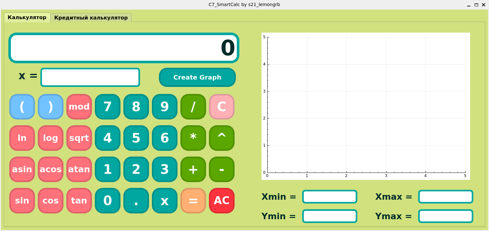
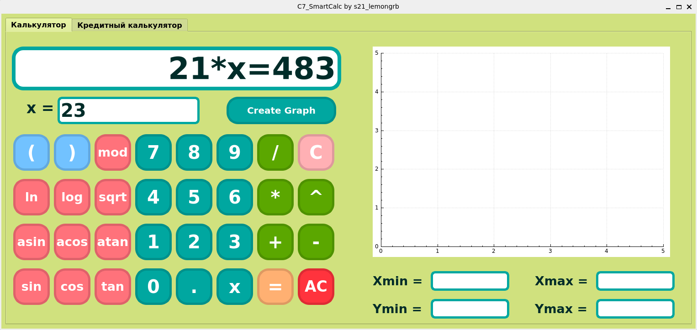
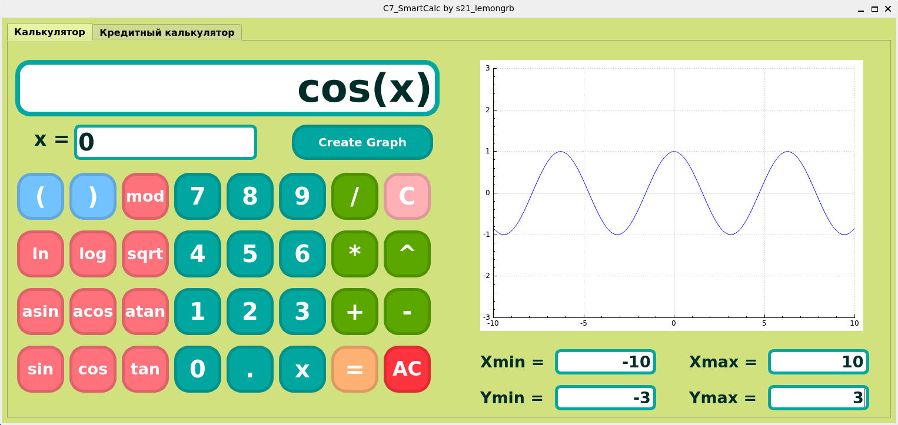
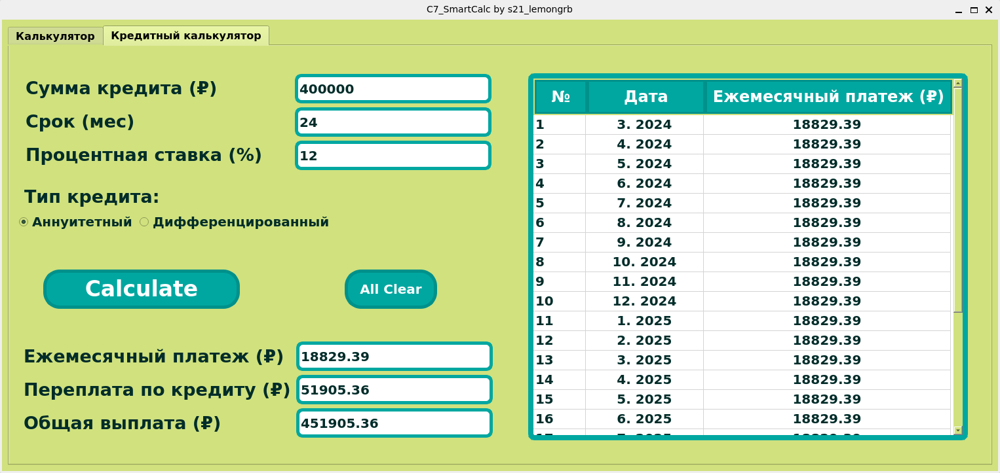
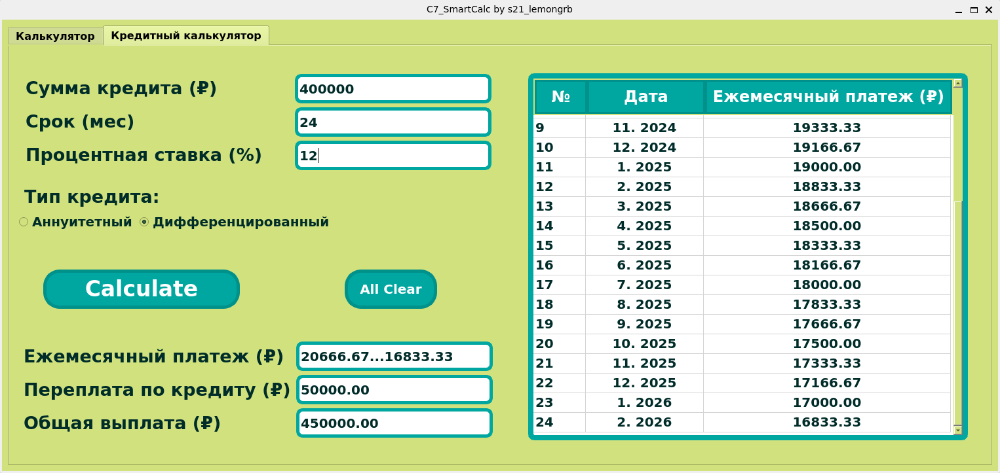

# SmartCalc_v1.0

## Содержание

1. [О проекте](#о-проекте)
2. [Особенности проекта](#особенности-проекта)
3. [Сборка](#сборка)

## О проекте

В данном учебном проекте "Школы 21" была реализована расширенная версия обычного калькулятора на языке C (стандарта 11) и C++ в рамках фреймворка Qt6 для визуализации десктопного интерфейса. Программа способна рассчитать кредит с выбранным типом: аннуитетный и дифференцированный. Для изменения режима работы калькулятора используются вкладки в верхней части программы.

*Калькулятор, стартовый экран*

### Список возможностей программы:
* Пользователь может вводить значения в поля ввода как с помощью кнопок, предусмотренных в программе, так и с клавиатуры;
* Поле выражения поддерживает до 255 вводимых символов. При вводе имен функций с клавиатуры необходимо прописывать их в нижнем регистре. Выражения могут быть составлены с помощью переменной «x», значение которой можно ввести в поле ниже (для ввода доступны целые значения);

	

	

	*Иллюстрация к вычислению выражений с X*
	

* Когда пользователь нажимает на кнопку операции, в основное поле для выражения автоматически вводится открывающая скобка;
* Программа способна вычислять следующие функции:
	* cos(x);
	* sin(x);
	* tan(x);
	* acos(x);
	* asin(x);
	* atan(x);
	* sqrt(x);
	* ln(x);
	* log(x).
* Программа использует следующие операторы:
	* скобки ();
	* сложение +;
	* вычитание -;
	* умножение *;
	* деление /;
	* степень ^;
	* остаток от деления mod;
	* унарный плюс +a;
	* унарный минус -a.

* Работа с графиком происходит через стороннюю библиотеку [QCustomPlot](https://www.qcustomplot.com/). Чтобы построить график, нужно обозначить минимальное и максимальное значения переменных x и y (задать границы отображаемой области графика). Для выполнения вычислений необходимо ввести значение переменной x в основное поле для выражений. Чтобы отобразить график, необходимо нажать на кнопку **«Создать график»**. Масштаб графика можно изменить с помощью мыши.

	>Область определения и область значения функций ограничены числами от -1000000 до 1000000. Если ввести значение, выходящее за эти пределы, программа установит значение, равное пределу.

	

	

	*Отрисовка графика*
	

* Кредитный калькулятор предоставляет таблицу с датой погашения кредита и суммой ежемесячного платежа в зависимости от выбранного типа, суммы кредита, процентной ставки и срока. Пользователь может ознакомиться с общей суммой погашения кредита и переплаты.
	>Калькулятор поддерживает ввод суммы кредита до 16 символов, срока кредита до 3 символов, процентной ставки до 6 символов.

	

	

	*Аннуитетный тип кредита*
	

	

	

	*Дифференцированный тип кредита*
	

## Особенности проекта

В рамках учебного проекта неоходимо было соответствовать следующим требованиям:
* Программа разработана в соответствии с принципами объектно-ориентированного программирования и использованием компилятора gcc;
* При написании кода необходимо придерживаться Google Style;
* Модули, связанные с вычислением выражений, покрываются unit-тестами (используется библиотека Check);
* Перевод арифметических выражений из классической (инфиксной нотации) в обратную польскую нотацию (постфиксная нотация) для произведения вычислений. Алгоритм сортировочной станции основан на стеке;

## Makefile

Makefile проекта содержит следующие цели:

&nbsp;&nbsp;&nbsp;&nbsp;``all`` - включает в себя цели clean, dist, gcov_report, dvi;

&nbsp;&nbsp;&nbsp;&nbsp;``install`` - собирает десктопную версию калькулятора и перемещает её в папку build;

&nbsp;&nbsp;&nbsp;&nbsp;``uninstall`` - удаляет папку build с проектом;

&nbsp;&nbsp;&nbsp;&nbsp;``dist`` - создание архив-пакета, содержащего в себе все необходимые файлы и инструкции для установки игры;

&nbsp;&nbsp;&nbsp;&nbsp;``test`` - Запускает unit-тесты на проверку модулей, связанных с вычислением выражений, с помощью библиотеки Check;

&nbsp;&nbsp;&nbsp;&nbsp;``gcov_report`` - генерация html-отчета с помощью lcov для измерения покрытия кода тестами;

**dvi** - открывает файл с документацией проекта;

&nbsp;&nbsp;&nbsp;&nbsp;``check`` - анализирует код на стилистические нормы;

&nbsp;&nbsp;&nbsp;&nbsp;``valgrind`` - проверка файла с тестами на возможные утечки;

&nbsp;&nbsp;&nbsp;&nbsp;``clean`` - удаляет файлы, созданные во время прохождения тестов, отчеты о покрытии, объектные файлы.
