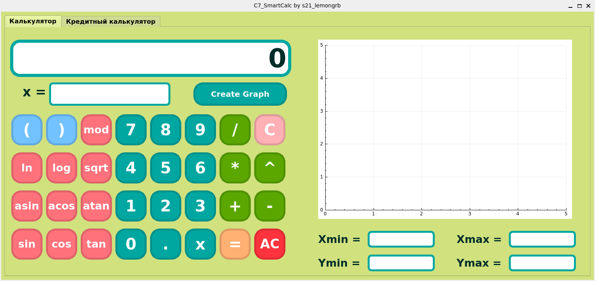
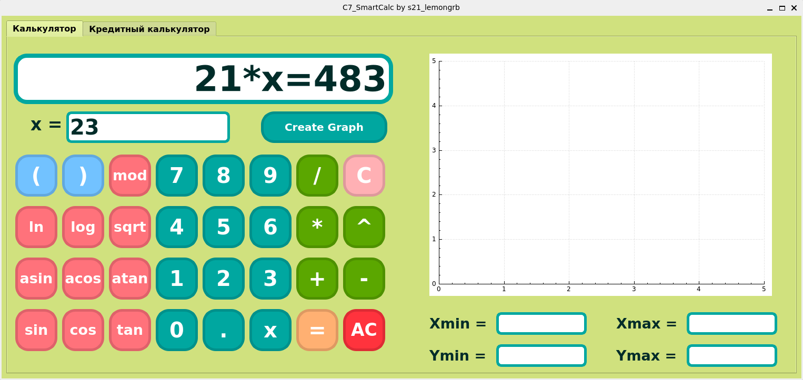
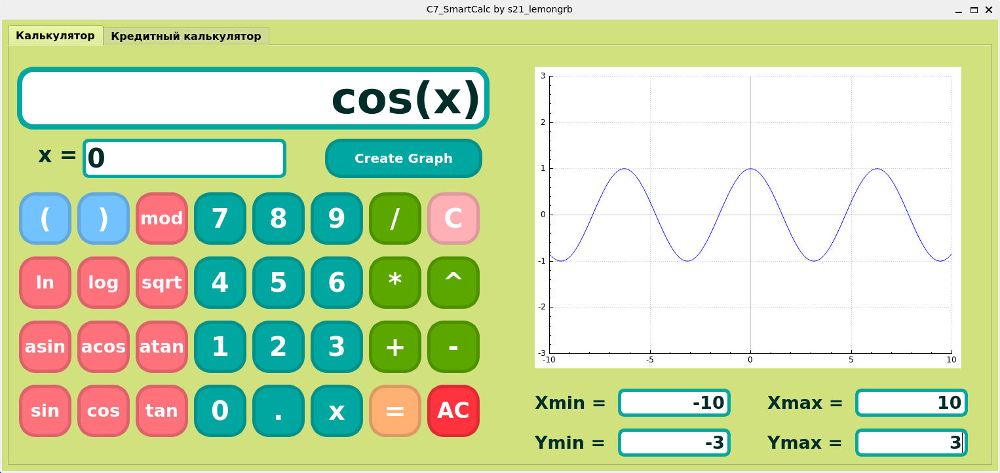
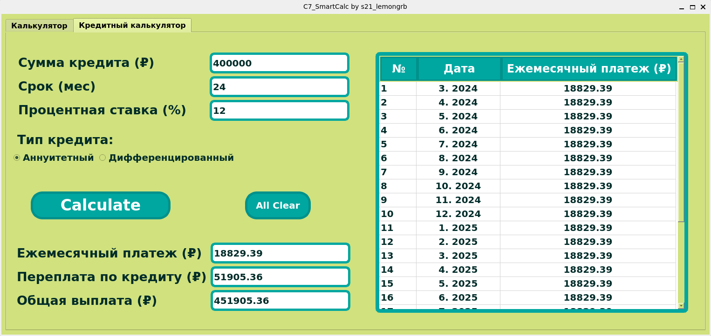
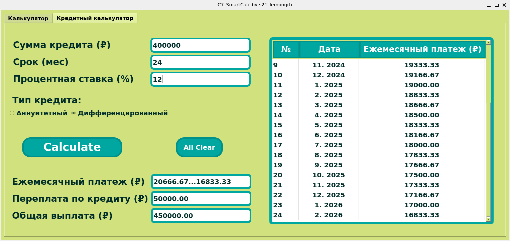

# **C7_SmartCalc_v1.0-1 by s21_lemongrb**

This calculator is written in c/c++ program language and with the help of QT Creator version 6.6.2.
The program is able to calculate the loan with the selected type: annuity and differentiated type.
Use the tabs at the top of the program to change the calculator mode.

<div align=center>


*Calculator, start screen*
</div>


## Installation

**Prerequisites**:
- To install the program, you must anticipate the presence of installed utilities in advance:
    - `gcc`
    - `make`
    - `qmake`

- To run this program, write in the terminal:

```
make install
```

The program "SmartCalc" will be located in the "build" folder.


## Functionality

The user can enter values into the input fields either by using the buttons provided in the program or by using the keyboard.
The expression field supports up to 255 entered characters. 
When entering function names from the keyboard, write them in lowercase form.
Expressions can be composed with the variable "x", whose value can be entered in the field below (integer values are available for entry).


It is capable of calculating the following functions:

| Function description | Function |
| ------ | ------ |
| Sine | sin(x) |
| Cosine | cos(x) |
| Tangent | tan(x) |
| Arccosine | acos(x) |
| Arcsine | asin(x) |
| Arctangent | atan(x) |
| Square root | sqrt(x) |
| Natural logarithm | ln(x) |
| Decimal logarithm | log(x) |

>When the user click on the operation button, an opening parenthesis is automatically entered into the main field for the expression.


And use operators such as:

| Operator name | Infix notation |
| ------ | ------ |
| Brackets | (a + b) |
| Addition | a + b |
| Subtraction | a - b |
| Multiplication | a * b |
| Division | a / b |
| Enlargement | a ^ b |
| Remainder | a mod b |
| Unary plus | +a |
| Unary minus | -a |

<div align=center>


*X Calculation*

</div>

## Graphic creation

To draw the graph, we need to label the minimum and maximum values of the variables x and y (set the boundaries of the displayed area of the graph). 
To perform calculations it is necessary to enter the value using the x variable into the main field for expressions.
To display the graph, you should click on the "create graph" button.
You can change the scale of the graph with the mouse.

>The area of definition and the area of value of functions are limited to the numbers from -1000000 to 1000000. If a value outside this limit is entered, the program will set the value equal to the limit.

<div align=center>


*Graph Drawing*
</div>


## Credit calculator

The loan calculator provides a table with the date of repayment with the monthly payment amount depending on the selected type, loan amount, interest rate and term. 
The user can familiarize himself with the total loan repayment amount and overpayment.

>The calculator supports entering up to 16 characters of loan amount, loan term up to 3 characters, interest rate up to 6 characters.

<div align=center>


*Annuity type of loan*
</div>

<div align=center>


*Differentiated loan type*
</div>